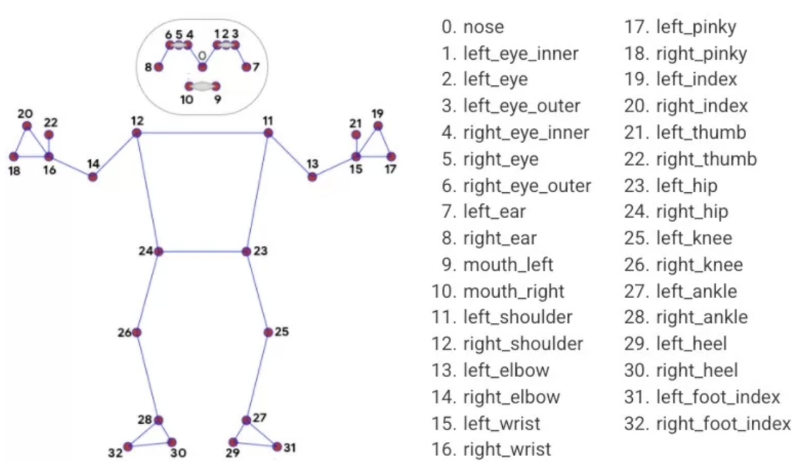

# Artificial-intelligence
NIRS

Интервалы видеофрагментов:
-	[1, 10] – Бег(боковая проекция)
-	[11, 20] – Присяд
-	[21, 30] – Выпады 
-	[31, 40] – Наклоны туловища 
-	[41, 60] – Ходьба(фронтальная проекция)
-	[61, 70] – Ходьба(боковая проекция)
-	[71, 89] – Вертикальный прыжок

P.s. git config http.postBuffer 524288000
